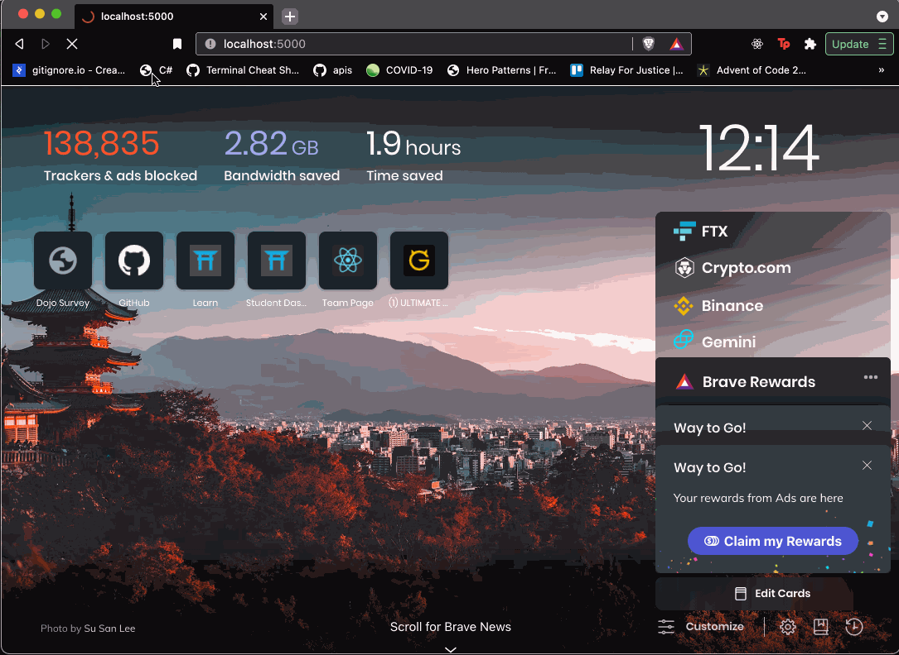

# Dojo Survey With Validation

## Coding Dojo Practice 07.12.2022

 

### Learning Objectives:
- Students will work with a database.
- Students will validate user input.
- Students will using flash messages.

 

Take the Dojo Survey assignment that you completed previously and add a database and validations! All fields are required.

 

**Step:**
- Use the Dojo Survey assignment that you completed previously
- Create a new schema called dojo_survey_schema
- Add a dojos table with the following fields: id, name, location, language, comment, created_at and updated_at
- Forward engineer and connect the Flask to the database
- Add validations to make all fields required
 -Display any validation errors under the form